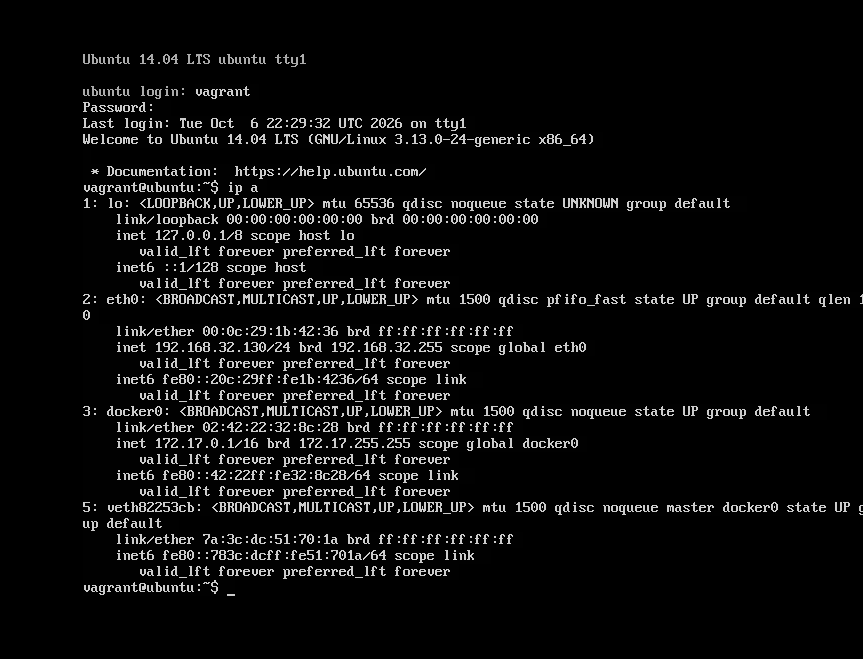
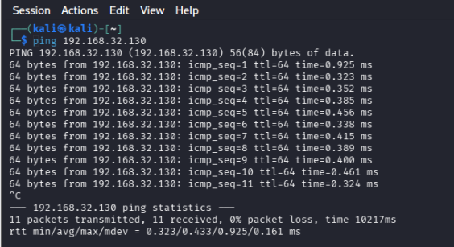

# Conectividad entre Kali y Metasploitable Ubuntu

## Objetivo

Comprobar que Kali puede comunicarse mediante ICMP con el objetivo Ubuntu del laboratorio antes de comenzar las prácticas de análisis de seguridad.

## Entorno observado

- Virtualización: VMware; versión pendiente de registrar.
- Estación de pruebas: Kali Linux; versión instalada e IP pendientes de verificar. El nombre de la VM indica 2026.2, pero no sustituye una consulta al sistema.
- Objetivo: `metasploitable3-ub1404`, Ubuntu 14.04 LTS, kernel `3.13.0-24-generic`, según la consola.
- Interfaz del objetivo: `eth0`, activa, con dirección `192.168.32.130/24`.
- Red correspondiente al objetivo: `192.168.32.0/24`.
- Las capturas de configuración previas muestran adaptadores en modo Sólo host y 4 GB de RAM y 2 procesadores por VM.
- Metasploitable Windows queda disponible para prácticas posteriores. La VM Windows 10 Pro no tiene todavía un uso definido.

## 1. Identificación de la dirección del objetivo

En Ubuntu se ejecutó:

```bash
ip a
```

Se seleccionó la dirección de `eth0`: `192.168.32.130`. La salida también muestra `docker0` con `172.17.0.1/16`; esa dirección pertenece al puente de Docker y no fue el destino de esta prueba.



## 2. Prueba desde Kali

```bash
ping 192.168.32.130
```

La ejecución se detuvo con `Ctrl+C` después de 11 solicitudes.



## Resultados

| Métrica | Resultado |
|---|---|
| Paquetes enviados | 11 |
| Paquetes recibidos | 11 |
| Pérdida | 0 % |
| RTT mínimo | 0.323 ms |
| RTT promedio | 0.433 ms |
| RTT máximo | 0.925 ms |
| TTL observado en respuestas | 64 |

La prueba confirma conectividad ICMP con el objetivo en ese momento. No es un descubrimiento automático de equipos: se probó una IP obtenida previamente en la consola de Ubuntu.

## Alcance y límites

El resultado no demuestra qué puertos o servicios están disponibles, ni confirma vulnerabilidades. Tampoco verifica por sí solo el aislamiento respecto de Internet o de la red física. El modo Sólo host está documentado mediante las capturas de configuración, pero falta revisar rutas y cualquier conectividad adicional.

## Próximos pasos

- Registrar la IP y las rutas de Kali mediante `ip -br addr` e `ip route`.
- Confirmar la versión de Kali mediante `cat /etc/os-release`.
- Completar la topología y verificar el aislamiento del laboratorio.
- Registrar snapshots antes de las siguientes prácticas.
