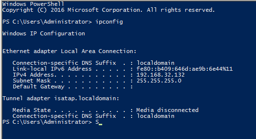
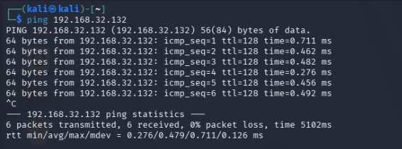

# Conectividad entre Kali y Metasploitable Windows

## Objetivo

Comprobar la conectividad ICMP desde Kali hacia el segundo objetivo propio del laboratorio antes de las prácticas de enumeración SMB y SNMP.

## Dirección del objetivo

En la máquina identificada por el autor como Metasploitable Windows se ejecutó:

```powershell
ipconfig
```



| Campo | Valor observado |
|---|---|
| Adaptador | Local Area Connection |
| IPv4 | 192.168.32.132 |
| Máscara | 255.255.255.0 (/24) |
| Red correspondiente | 192.168.32.0/24 |
| Puerta de enlace predeterminada | Campo vacío en la salida |

La IP difiere de la del objetivo Ubuntu (`192.168.32.130`), aunque ambas pertenecen a la misma subred. Las capturas previas de VMware muestran la VM `metasploitable3-win2008` en modo Sólo host, con 4 GB de RAM, 2 procesadores y disco de 60 GB. La presente captura no verifica la versión exacta de Windows; no se deduce de la fecha de copyright de PowerShell. Esta VM se distingue de la otra denominada Windows 10 Pro - Laboratorio, cuyo uso sigue sin definir.

## Ping desde Kali

```bash
ping 192.168.32.132
```

La prueba se detuvo con `Ctrl+C` después de seis solicitudes.



| Métrica | Resultado |
|---|---|
| Paquetes enviados | 6 |
| Paquetes recibidos | 6 |
| Pérdida | 0 % |
| RTT mínimo | 0.276 ms |
| RTT promedio | 0.479 ms |
| RTT máximo | 0.711 ms |
| TTL de las respuestas | 128 |

## Interpretación y límites

El objetivo respondió a ICMP desde Kali en el momento de la prueba. Esto no verifica disponibilidad de SMB o SNMP, acceso a recursos compartidos ni vulnerabilidades. El TTL no permite identificar de forma concluyente el sistema operativo. La ausencia de puerta de enlace en esta salida tampoco demuestra por sí sola el aislamiento completo del equipo.

## Continuación

Documentar la enumeración SMB y, si se encuentra disponible, SNMP como prácticas separadas en `ethical-hacking-labs`. La IP y las rutas de Kali siguen pendientes por decisión del autor.
